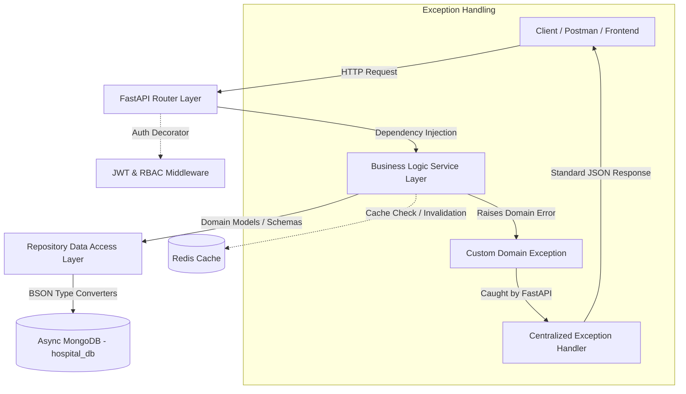

# 🎓 Hospital Management Backend — Engineering Masterclass & Proof of Work

Welcome to the **Engineering Masterclass & Proof of Work Documentation** for the Hospital Management System backend built with **FastAPI**, **Async MongoDB (PyMongo)**, and **Redis**.

This repository is designed not only as a functional healthcare backend, but as a **living laboratory and portfolio** demonstrating production-grade software engineering principles, layered clean architecture, asynchronous I/O performance tuning, and robust backend system design.

---

## 🗂️ Documentation Index & Modules

| Module | Document | Core Engineering Concepts |
| :--- | :--- | :--- |
| **00** | [00_proof_of_work_and_roadmap.md](file:///c:/Users/Asus/Documents/fastapi/Hospital-Management/understand.md/00_proof_of_work_and_roadmap.md) | Portfolio Showcase, Engineering Checklist, System Design Mastery Roadmap |
| **01** | [01_architecture_and_design_patterns.md](file:///c:/Users/Asus/Documents/fastapi/Hospital-Management/understand.md/01_architecture_and_design_patterns.md) | Clean/Layered Architecture, Repository Pattern, Dependency Injection, Separation of Concerns |
| **02** | [02_mongodb_bson_type_system.md](file:///c:/Users/Asus/Documents/fastapi/Hospital-Management/understand.md/02_mongodb_bson_type_system.md) | BSON vs Python Types, `Decimal128`, `DateTime`, `ObjectId`, Data Boundary Converters |
| **03** | [sync-vs-async.md](file:///c:/Users/Asus/Documents/fastapi/Hospital-Management/understand.md/sync-vs-async.md) | Async I/O, Event Loop, Non-blocking DB Drivers, Concurrent Request Handling |
| **04** | [04_exception_handling_and_domain_errors.md](file:///c:/Users/Asus/Documents/fastapi/Hospital-Management/understand.md/04_exception_handling_and_domain_errors.md) | Custom Domain Exceptions, Centralized Exception Handlers, Standardized API Error Responses |
| **05** | [05_authentication_and_rbac_middleware.md](file:///c:/Users/Asus/Documents/fastapi/Hospital-Management/understand.md/05_authentication_and_rbac_middleware.md) | JWT Security Context, Password Hashing (`bcrypt`), Role-Based Access Control (RBAC) |
| **06** | [standard_ci_cd_workflow.md](file:///c:/Users/Asus/Documents/fastapi/Hospital-Management/understand.md/standard_ci_cd_workflow.md) | GitHub Actions, Automated Testing, Code Quality & Linting Pipelines |

---

## 📐 High-Level Architecture Overview

---

## 🌟 Key Engineering Takeaways

1. **Strict Layered Separation**:
   - **Route Layer**: HTTP protocol details, status codes, request parsing, response formatting.
   - **Service Layer**: Business rules, validation logic, transaction coordination.
   - **Repository Layer**: Raw database queries, BSON serializations, Mongo collection abstractions.

2. **Database Boundary Protection**:
   - Business services deal strictly with Python native types (`Decimal`, `date`, `str`).
   - Repositories convert database-specific formats (`Decimal128`, `datetime`, `ObjectId`) transparently at the database boundary.

3. **Asynchronous Architecture**:
   - Built on PyMongo's `AsyncMongoClient` and Redis `redis.asyncio` to ensure non-blocking I/O execution across all database interactions.

---

## 🎯 How to Use This Knowledge for Learning & System Design

- Use **Module 00** as your checklist to track concepts you've mastered and upcoming features to implement.
- Review **Module 01** to understand clean architecture patterns applied to modern FastAPI services.
- Read **Module 03** for deep insights into Python concurrency, thread pools, and event loops.
- Follow the hands-on exercises in the **System Design Roadmap** to build real-world skills in caching, indexing, rate limiting, and event-driven architecture.
